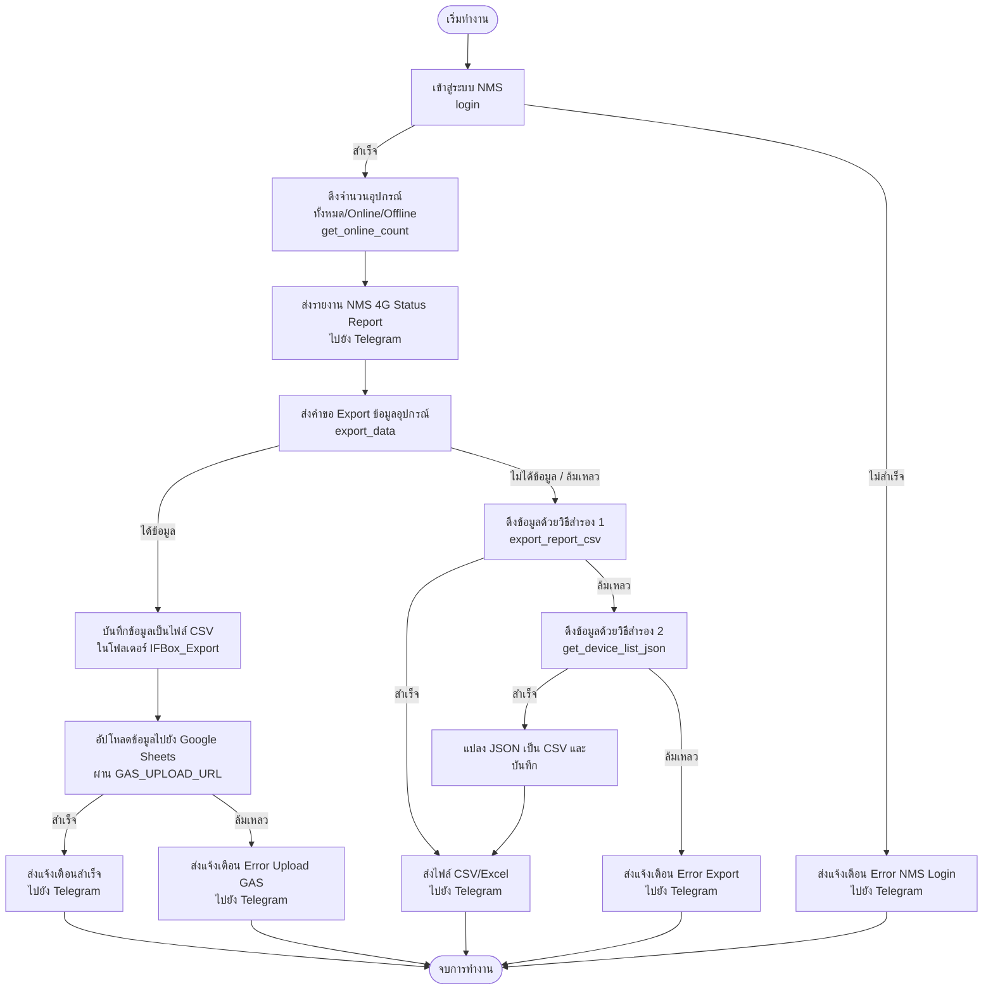

# 📡 Automation_4G (NMS Standalone Project)

[](https://www.python.org/)
[](https://www.google.com/sheets/)
[](https://telegram.org/)
[](https://github.com/)

ระบบกระบวนการทำงานอัตโนมัติรอบเดี่ยว (Standalone Task) เพื่อตรวจสอบสถานะและดึงข้อมูลอุปกรณ์ 4G Router จากระบบบริหารจัดการ **NMS (4G / PTGK Monitoring System)** พร้อมวิเคราะห์เปอร์เซ็นต์ความเสถียร (Health Rate) แจ้งเตือนข้อความรายงานสรุปผ่าน Telegram Bot และบันทึกข้อมูลเข้า Google Sheets แบบเรียลไทม์เพื่อแสดงผลบนหน้า Dashboard ในฝั่ง Google Cloud Web App

---

## 📌 ภาพรวมสถาปัตยกรรมและการไหลของข้อมูล (System Architecture & Data Flow)

สคริปต์และระบบทำงานประสานกันเป็นกระบวนการแบบลำดับขั้นตอน (Sequential Workflow) ดังแผนภาพ Mermaid ด้านล่างนี้:



---

## ✨ คุณสมบัติเด่น (Key Features)

*   🔐 **Auto Login & CSRF Extraction**: จัดการการเชื่อมต่อ ตรวจสอบสิทธิ์ (Authentication) และดึงรหัสความปลอดภัย CSRF Token (`__hash__` และ `login_type`) จากหน้า HTML ไปยัง NMS เซสชันอัตโนมัติ
*   📊 **Real-time Status Monitoring**: รายงานเปอร์เซ็นต์ความเสถียร (Network Health Rate) คำนวณยอดอุปกรณ์ Online/Offline แยกตามเขตพื้นที่ของการไฟฟ้าอย่างแม่นยำ
*   ✉️ **HTML Telegram Notifications**: ส่งสรุปสถานะเครือข่ายพร้อมแถบความคืบหน้ากราฟิก (e.g. `[██████████░░] 85.0% Healthy`) ไปยังกลุ่มแชทหลัก และแยกแจ้งเตือนข้อผิดพลาดของระบบผ่านบอตตัวสำรอง (Error Bot)
*   ☁️ **Cloud Sheets Synchronization**: ซิงค์ตารางข้อมูลเข้า Google Sheets แบบเรียลไทม์ พร้อมกลไกตัดคอลัมน์ข้อมูลส่วนเกิน (สูงสุด 37 คอลัมน์) เพื่อความสะอาดและเป็นระเบียบ
*   🔄 **3-Level Multi-Fallback Engines**: ระบบสำรองข้อมูลเมื่อช่องทางดึงตารางหลักขัดข้อง (ดึงผ่าน JSON -> ตรวจรับไฟล์ Binary Spreadsheet -> ดึงผ่าน JSON API ย่อยมาแปลงสร้างเป็นตาราง CSV ในเครื่อง)
*   💾 **Excel-Ready Local Backups**: บันทึกข้อมูลรายงานในรูปแบบ CSV เข้ารหัสด้วย `utf-8-sig` (Byte Order Mark) ป้องกันภาษาไทยเพี้ยนเมื่อเปิดใช้งานในโปรแกรม Microsoft Excel
*   ⏰ **Fixed Bangkok Timezone**: ล็อกระบบและบันทึกเวลาให้เป็นโซนเวลา `Asia/Bangkok` (UTC+7) ทั้งหมด เพื่อป้องกันวันเวลาคลาดเคลื่อนจากเขตเวลาของเครื่องรันสคริปต์หรือเซิร์ฟเวอร์ Google Cloud

---

## 📊 โครงสร้างข้อมูลบน Google Sheets (Google Sheets Data Structure)

เพื่อให้หน้า Dashboard และการอัปเดตระบบทำงานได้สอดประสานกัน โครงสร้างข้อมูลบน Google Sheets จะต้องแบ่งออกเป็นหน้าต่าง ๆ ดังนี้:

### 1. ชีตสรุปภาพรวม (`สรุป`)
เก็บข้อมูลสถิติมิติต่าง ๆ และเก็บบันทึกวันเวลาในการดึงอัปเดตครั้งล่าสุด
*   **Dynamic Update Datetime**:
    *   ใช้คีย์หรือป้ายชื่อ `lastupdated4g` (หรือเก็บที่เซลล์ `C10`) สำหรับเก็บเวลาล่าสุดของข้อมูล 4G/NMS
    *   ใช้คีย์หรือป้ายชื่อ `lastupdatedscada` (หรือเก็บที่เซลล์ `C11`) สำหรับเก็บเวลาล่าสุดของข้อมูลระบบ SCADA
    *   ระบบฝั่ง Apps Script ([Code.gs](WebApp/Code.gs)) รองรับการอ่านและคำนวณวันเวลาทั้งชนิดข้อความ (String) และค่าตัวเลขลำดับวันของ Google Sheets (Serial Date Numbers) โดยแปลงกลับมาเป็นรูปแบบไทยสากล (`dd/MM/yyyy HH:mm`) เสมอ
*   **ข้อมูลสรุป**: แยกแยะคำค้นหาจากคอลัมน์เพื่อประเมินความสมบูรณ์ เช่น "จำนวนติดตั้ง", "Total", "Online" หรือ "4GOnline", "ONLINE", "FAILED", "REMOVE" และ "Commissioning"

### 2. ชีตรายเขตพื้นที่ (`ข้อมูลรายเขต`)
ประกอบด้วยตารางข้อมูลจำแนกข้อมูลสถิติตามการไฟฟ้าเขต คอลัมน์ที่บังคับใช้งานประกอบด้วย:
*   `CODE`: รหัสเขตของการไฟฟ้า (เช่น BBD, BKD, SSD)
*   `การไฟฟ้าเขต`: ชื่อภาษาอังกฤษหรือภาษาไทยควบคู่รหัสเขต (เช่น Samsen (SSD), Yannawa)
*   `จำนวนติดตั้ง`: จำนวนอุปกรณ์เป้าหมายสะสมตามแผนการดำเนินงาน
*   `จำนวน NMS`: จำนวนกล่อง NMS ที่ลงทะเบียนใช้งานในระบบ
*   `NMS Online`: จำนวนกล่อง NMS ที่ Online จริง
*   `จำนวน SCADA`: ยอดอุปกรณ์ที่อยู่ในขั้นตอน Commissioning ทั้งหมด (SCADA Total)
*   `SCADA Online`: ยอดจำนวนอุปกรณ์ที่เชื่อมต่อส่งข้อมูลเข้า SCADA ได้อย่างสมบูรณ์

### 3. ชีตบันทึกข้อมูลดิบ (`NMS` / `eSight` / `SCADA`)
*   **`NMS`**: รับข้อมูลตารางชุดดิบจาก NMS 4G (อัปเดตผ่าน Python หรือเว็บอัปโหลด [Index.html](WebApp/Index.html))
*   **`eSight`**: รับตารางข้อมูลอุปกรณ์ดิบของระบบ eSight
*   **`SCADA`**: รับตารางข้อมูลดิบการเชื่อมต่อฝั่งระบบ SCADA

---

## 📁 โครงสร้างโฟลเดอร์โปรเจกต์ (Project Structure)

```text
Automation_4G/
├── IFBox_Export/           # โฟลเดอร์เก็บไฟล์สำรอง CSV บนเครื่อง (Local backups) [Git-ignored]
├── WebApp/                 # ไฟล์ซอร์สโค้ดระบบบริการของ Google Apps Script Web App
│   ├── Code.gs             # สคริปต์ประมวลผลหลังบ้าน (doGet, doPost, getDashboardData)
│   ├── Dashboard.html      # หน้าจอรายงาน Single Page Dashboard แบบ Responsive
│   └── Index.html          # หน้าเว็บสำหรับการลากและวางอัปโหลดไฟล์ (.xlsx) ด้วยมือ
├── .env.example            # แม่แบบสำหรับการกรอกข้อมูลสภาพแวดล้อม
├── .gitignore              # ไฟล์กำหนดข้อยกเว้นระบบควบคุมเวอร์ชัน Git
├── config.py               # โค้ดสำหรับโหลดค่า config จากไฟล์ .env
├── nms.py                  # สคริปต์ประมวลผลหลัก (Login, Export, Backup, GAS API Upload)
├── notify.py               # ฟังก์ชันจัดเตรียมเทมเพลตและส่งข้อความแจ้งเตือนเข้า Telegram
└── requirements.txt        # ไฟล์ระบุรายการแพ็กเกจไลบรารีของ Python
```

---

## ⚙️ ขั้นตอนการติดตั้ง (Installation)

### 1. การเตรียมสภาพแวดล้อม Python (Local Environment Setup)
แนะนำให้รันแอปพลิเคชันผ่าน Python Virtual Environment (venv) เพื่อความเสถียรของระบบ:

1.  **สร้างสภาพแวดล้อมจำลอง (Virtual Environment)**:
    ```bash
    python -m venv venv
    ```
2.  **เปิดการใช้งานสภาพแวดล้อมเสมือน**:
    *   **Windows (PowerShell)**:
        ```powershell
        .\venv\Scripts\Activate.ps1
        ```
    *   **Windows (Command Prompt)**:
        ```cmd
        .\venv\Scripts\activate.bat
        ```
    *   **Linux / macOS**:
        ```bash
        source venv/bin/activate
        ```
3.  **ติดตั้งไลบรารีและโมดูลเชื่อมโยง**:
    ```bash
    pip install -r requirements.txt
    ```

### 2. การ Deploy Google Apps Script Web App (GAS Deployment)
1.  สร้างหรือเปิดตาราง Google Sheets ของคุณ
2.  ไปที่แถบเมนูด้านบน คลิกที่ **Extensions** (ส่วนขยาย) > **Apps Script** (แอปส์สคริปต์)
3.  ทำการสร้างสคริปต์และวางซอร์สโค้ด:
    *   ลบโค้ดเริ่มต้นในไฟล์ `Code.gs` ออก แล้วนำเนื้อหาจาก [WebApp/Code.gs](WebApp/Code.gs) ไปใส่แทน
    *   คลิกเครื่องหมาย `+` เพื่อสร้างไฟล์ HTML ตั้งชื่อว่า `Dashboard` แล้วนำเนื้อหาใน [WebApp/Dashboard.html](WebApp/Dashboard.html) ไปใส่
    *   คลิกเครื่องหมาย `+` เพื่อสร้างไฟล์ HTML อีกไฟล์ ตั้งชื่อว่า `Index` แล้วนำเนื้อหาใน [WebApp/Index.html](WebApp/Index.html) ไปใส่
4.  ทำการเผยแพร่เว็บแอป (Deployment):
    *   คลิกปุ่ม **Deploy** (ปรับใช้งาน) > **New deployment** (การปรับใช้งานใหม่)
    *   เลือกประเภทการปรับใช้งานเป็น **Web App** (เว็บแอป)
    *   กำหนดค่าการใช้งานดังนี้:
        *   **Execute as** (เรียกใช้งานในฐานะ): `Me` (บัญชีอีเมล Google ของคุณเอง)
        *   **Who has access** (ผู้มีสิทธิ์เข้าถึง): `Anyone` (ทุกคน)
    *   กดปุ่ม **Deploy** (ปรับใช้งาน) และกดให้สิทธิ์ตรวจสอบการทำงานสเปรดชีต (Authorize access) ให้เรียบร้อย
5.  คัดลอก **Web App URL** (ที่ขึ้นต้นด้วย `https://script.google.com/macros/s/.../exec`) เพื่อนำไปกำหนดค่าในไฟล์คอนฟิกสภาพแวดล้อมต่อไป

### 3. การกำหนดตัวแปรสภาพแวดล้อม (.env)
คัดลอกไฟล์ `.env.example` ไปตั้งชื่อใหม่ว่า `.env` เพื่อนำไปใช้งานจริง:
```bash
cp .env.example .env
```
เปิดและแก้ไขข้อมูลค่าคอนฟิกต่าง ๆ ในไฟล์ `.env` ตามรายละเอียดด้านล่าง:

| ตัวแปรคอนฟิก (Variable Name) | หน้าที่และคำอธิบาย | ตัวอย่างการกำหนดค่า |
| :--- | :--- | :--- |
| `NMS_URL` | URL ของหน้าลงชื่อเข้าใช้ของระบบ NMS 4G | `http://192.168.12.101` |
| `NMS_USER` | ชื่อบัญชีสิทธิ์สำหรับล็อกอิน NMS | `admin` |
| `NMS_PASS` | รหัสผ่านสำหรับล็อกอิน NMS | `your_secret_password` |
| `NMS_EXPORT_DIR` | พาธโฟลเดอร์สำหรับสำรองรายงาน CSV (ค่าเริ่มต้นคือ `IFBox_Export`) | `IFBox_Export` |
| `GAS_UPLOAD_URL` | URL Web App ที่คัดลอกมาจากขั้นตอนการ Deploy GAS Web App | `https://script.google.com/macros/s/.../exec` |
| `TELEGRAM_BOT_TOKEN` | Token ของ Telegram Bot สำหรับแจ้งเตือนกลุ่มหลักและส่งไฟล์ผลลัพธ์ | `7752414527:AAGVqC3j...` |
| `TELEGRAM_CHAT_ID` | ID กลุ่มหลัก Telegram สำหรับส่งรายงานความสมบูรณ์เครือข่าย | `-4720156580` |
| `NOTIFY_BOT_TOKEN` | Token ของ Telegram Bot สำหรับส่งแจ้งเตือนข้อผิดพลาดระบบ (Error Bot) | `7752414527:AAGVqC3j...` |
| `NOTIFY_CHAT_ID` | ID กลุ่ม/แชทสำหรับรับการแจ้งเตือนความล้มเหลวในการรันระบบ | `-4720156580` |

---

## 🚀 ขั้นตอนการรันและการทดสอบระบบ (Execution & Operations)

### 1. การสั่งรันโปรแกรมด้วยตนเอง (Manual Execution)
เปิดใช้งาน virtual environment แล้วรันสคริปต์หลักของโปรเจกต์:
```bash
python nms.py
```
> [!NOTE]
> **วงจรการทำงานเมื่อทำการเรียกใช้งาน**:
> 1. สคริปต์จะใช้ `BeautifulSoup4` ขูดดึงค่า Token ล็อกอิน (`__hash__` และ `login_type`) ส่ง HTTP POST ล็อกอินรักษาสิทธิ์เซสชันในระบบ
> 2. ดึงจำนวนและสรุปอุปกรณ์ส่งรายงานสรุป Network Status Report สไตล์แดชบอร์ดเข้ากลุ่ม Telegram หลักทันที
> 3. ส่งคำสั่งดึงข้อมูลตารางและแปลงเป็น CSV เข้ารหัส `utf-8-sig` สำรองลงในเครื่อง
> 4. ยิงข้อมูลตารางขึ้น Google Sheets ผ่าน GAS Web App ในรูป JSON สองมิติ (อัปเดต 37 คอลัมน์)
> 5. หากอัปเดตเสร็จสิ้นบอตจะส่งสถานะยืนยันความสำเร็จผ่าน Telegram หากมีข้อผิดพลาดจะแจ้งผ่านบอต Notify และส่งไฟล์ CSV แนบให้ผู้ใช้แทน

### 2. การทำงานอัปโหลดไฟล์ด้วยตนเองผ่านเบราว์เซอร์ (Manual File Upload UI)
ในกรณีที่ NMS มีระบบความปลอดภัยสูง หรือปิดกั้นสคริปต์ ผู้ดูแลระบบสามารถนำเข้าข้อมูลได้ผ่านหน้าเว็บอัปโหลด:
1.  เปิดบราวเซอร์และพิมพ์ URL: `[GAS_UPLOAD_URL]?page=upload` (ตามลิงก์ Web App ใน .env)
2.  หน้าจอเว็บจะแสดงหน้าต่างเครื่องมือสำหรับอัปโหลดข้อมูล **Device Report Interface Box**
3.  ลากไฟล์รายงานรูปแบบ `.xlsx` จากระบบ NMS มาวาง หรือกดคลิกเลือกไฟล์
4.  หน้าบ้านจะเรียกใช้งาน **SheetJS** แยกแยะประมวลผลข้อมูลและแปลงเป็น JSON Array 2 มิติและอัปโหลดเข้าสู่ Google Sheets ให้โดยตรงโดยไม่ต้องใช้โค้ดฝั่ง Server

### 3. การตั้งเวลารันอัตโนมัติ (Automated Scheduling Setup)

#### 💻 สำหรับ Windows Server / Windows Local (Task Scheduler):
1.  เปิดเครื่องมือ **Task Scheduler** กดคลิกที่เมนู **Create Basic Task...**
2.  ตั้งชื่อภารกิจ เช่น `Automation_4G_NMS`
3.  เลือกเงื่อนไข Trigger: **Daily** (กำหนดซ้ำทุกวัน และกดเข้าตั้งค่าขั้นสูงให้รันซ้ำทุก 1 ชั่วโมง)
4.  ในแท็บ Action เลือก **Start a program**
5.  กำหนดโปรแกรมสำหรับการรันให้ครบถ้วน:
    *   **Program/script**: ระบุตำแหน่งที่ตั้งตัวรัน Python ภายใน venv เช่น `D:\Playground\Automation_4G\venv\Scripts\python.exe`
    *   **Add arguments**: ระบุชื่อไฟล์หลัก `nms.py`
    *   **Start in**: ระบุที่อยู่พาธของโฟลเดอร์โปรเจกต์นี้ เช่น `D:\Playground\Automation_4G` *(จำเป็นมาก: ต้องระบุเพื่อป้อนตำแหน่งแวดล้อมให้สคริปต์ Python สามารถค้นพบไฟล์กำหนดค่า `.env` ได้ถูกต้อง)*

#### 🐧 สำหรับ Linux / macOS (Crontab):
เปิดเครื่องมือแก้ไขเวลารันงาน:
```bash
crontab -e
```
เพิ่มข้อความด้านล่างนี้เพื่อตั้งเวลารันสคริปต์ทุก ๆ 1 ชั่วโมงและเขียนรายงาน Log:
```text
0 * * * * cd /path/to/Automation_4G && /path/to/Automation_4G/venv/bin/python nms.py >> /path/to/Automation_4G/cron_run.log 2>&1
```

---

## 🛠️ รายละเอียดสถาปัตยกรรมระดับซอร์สโค้ด (Technical Architecture)

### 1. ระบบรักษาเซสชันและการเข้าสู่ระบบ (Session & Auth Extraction)
เนื่องจากระบบความปลอดภัยของ NMS 4G (Interface Box) มีการป้องกันด้วย Dynamic Token:
- **`NMSClient.login()`** จะเริ่มต้นทำ HTTP GET ไปยังหน้าล็อกอิน `/Index/index.html` นำค่าดิบมาวิเคราะห์ด้วย **BeautifulSoup (html.parser)** เพื่อค้นหาแอตทริบิวต์ `<input name="__hash__">` และ `<input name="login_type">` เพื่อเอา Token ที่เปลี่ยนไปตลอดเวลามารวมกับรหัสผ่านแล้วทำ POST ไปที่ `/Index/checkLogin.html` เพื่อคงเซสชันการส่งข้อมูลแบบ `Cookie-based session`

### 2. กลไกสำรองการดึงตารางข้อมูลอุปกรณ์ย้อนหลังแบบ 3 ระดับ (Multi-level Fallbacks)
หากช่องทางส่งออกตารางรายงาน NMS หลักเกิดข้อบกพร่องจากการดึงข้อมูล คลาส `NMSClient` จะถอยกลับไปทำงานด้วยวิธีสำรองตามลำดับดังนี้:
- **วิธีหลัก (Primary JSON-Body Export)**: สั่ง POST ไปยัง `/Term/exportTerm.html` เพื่อส่งออกข้อมูลอุปกรณ์ทั้งหมด ระบบจะพยายามดึงฟีลด์ข้อมูลและโครงสร้างผ่าน JSON
- **วิธีสำรองระดับ 1 (Binary Data Bypass)**: หาก Response จาก endpoint หลักส่งข้อมูลกลับมาในรูปแบบไบนารีแทนที่จะเป็น JSON (เช่น ข้อมูลสเปรดชีต Excel ตระกูล `.xlsx` หรือ `.xls` ที่เข้ารหัส `PK\x03\x04` หรือ `\xd0\xcf\x11\xe0`) สคริปต์จะทำการเขียนข้อมูลไบนารีดิบนั้นลงเครื่องเป็นไฟล์ทันที
- **วิธีสำรองระดับ 2 (JSON Load API & Local Parser)**: หากการส่งออกข้อมูลล้มเหลวโดยสิ้นเชิง สคริปต์จะพยายามทำ GET ไปยัง `/Term/loadTermData.html` เพื่อดาวน์โหลดข้อมูลดิบ JSON ของอุปกรณ์รายเครื่อง จากนั้นสคริปต์จะทำการวิเคราะห์คีย์ทั้งหมดในอาเรย์ของวัตถุ JSON และแปลงคีย์เหล่านั้นให้ออกมาเป็นฟอร์แมต CSV สำหรับการเปิดใน Excel ภาษาไทย (`utf-8-sig`) โดยอัตโนมัติ

### 3. ระบบคำนวณสถิติและเปรียบเทียบแนวโน้ม (Data Sync & State Tracking)
การอัปโหลดข้อมูลแบบ API ไปยัง Google Sheets ผ่าน Apps Script มีลอจิกการคำนวณและเก็บันทึกดังนี้:
- **การจำกัดคอลัมน์เกินความจำเป็น (Slicing & Padding)**: ฟังก์ชัน `importData` ใน [WebApp/Code.gs](WebApp/Code.gs) จะทำความสะอาดอาร์เรย์สองมิติ โดยตัดแถวที่มีจำนวนคอลัมน์เกิน `MAX_COLUMNS = 37` ทิ้ง หรือทำการเพิ่มคอลัมน์ว่างสำหรับข้อมูลที่มาไม่ครบ เพื่อให้หน้าสเปรดชีตแสดงผลได้สม่ำเสมอและไม่บิดเบี้ยว
- **การเปรียบเทียบการออนไลน์ (State Memory)**: สคริปต์จะอ่านสถานะ NMS, การเชื่อมต่อ VPN และระดับความเข้มสัญญาณ (Signal Strength >= 20) มาคำนวณและจัดเก็บยอดลงใน **PropertiesService** เพื่อบันทึกเป็นสถิติเปรียบเทียบและระบุแนวโน้ม (Trends) ขึ้นลงในการใช้งานของรอบการทำงานก่อนหน้าและบันทึกแสดงค่า `+` หรือ `-` บนหน้า Dashboard

### 4. การจัดการความเข้ากันได้ของวันเวลา (Timezone & Date Parsing)
- ข้อมูลระบบและสคริปต์ทั้งหมดถูกล็อคค่าเขตเวลา (Timezone) เป็น **`Asia/Bangkok` (UTC+7)** โดยสมบูรณ์ เพื่อป้องกันวันเวลาไม่สอดคล้องกันจากสภาพแวดล้อมที่ตั้งของเซิร์ฟเวอร์รันงานหรือเซิร์ฟเวอร์คลาวด์ Google Apps Script
- หน้าหลังบ้านของเว็บแอปมีฟังก์ชัน `parseDateValue` ที่ฉลาดพอที่จะตรวจจับได้ว่า วันเวลาที่ดึงมาจากหน้าสรุปเป็นชนิดข้อความ หรือเป็นชนิดตัวเลขลำดับวัน (Serial Date Numbers ของ Google Sheets/Excel เช่น `45187.02`) และคำนวณย้อนกลับมาเป็นวันที่รูปแบบ `dd/MM/yyyy HH:mm` โซนเวลาไทยที่ถูกต้องเสมอ
